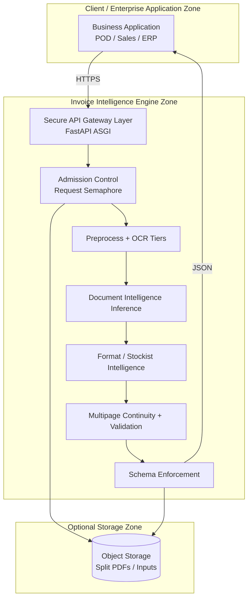

# Proprietary Invoice Intelligence & OCR Extraction Engine  
## Technical Architecture and Data Processing Specification

**Document type:** Enterprise technical architecture  
**Audience:** CTO, Solution Architect, Security / Compliance, Integration Engineering  
**Scope:** Python Invoice Intelligence / OCR extraction platform (API service)  
**Status:** Reflects the **current production codebase** with explicit **target architecture** where the reference Adaptive Invoice Intelligence model exceeds present implementation  

---

### Document control

| Item | Description |
|------|-------------|
| System name | Proprietary Invoice Intelligence & OCR Extraction Engine |
| Runtime | Python 3, ASGI (FastAPI), single-worker process model |
| Primary API port | 8001 |
| Integration pattern | Synchronous HTTPS multipart/JSON APIs consumed by upstream business applications (e.g. POD / Secondary Sales systems) |
| Persistence in this service | Stateless extraction; structured JSON responses; optional object storage for split documents |
| Classification | Client-facing technical specification (provider-agnostic wording) |

---

## 1. Executive Summary

This platform is a **domain-specialized Invoice Intelligence engine** that converts pharmaceutical and distribution invoices (PDF, image, Excel) and related commercial documents (sales statements, POD GRN workbooks) into **validated, schema-normalized structured JSON**.

It is **not** a generic OCR wrapper. Processing is a **multi-stage pipeline**:

1. Secure document ingestion  
2. Deterministic preprocessing and free-tier OCR where possible  
3. Layout- and format-aware extraction  
4. Invoice-specific AI document understanding for structured field and line-item resolution  
5. Stockist / template intelligence overrides  
6. Multi-page continuity, validation, and confidence-aware post-processing  
7. Canonical response packaging for downstream ERP / POD workflows  

**Current implementation strengths**

- Production FastAPI service with request admission control and health probes  
- Four-tier OCR strategy minimizing paid inference where native PDF text is available  
- Extensive **supplier/format intelligence** (dozens of pharmaceutical stockist/layout detectors and fixups)  
- Multi-page invoice continuity with page-level validation and controlled fallback  
- Excel and POD GRN structured parsers without OCR  
- Optional private object storage for split invoice artifacts  

**Current architectural constraints (honest)**

- The service is **stateless** with respect to extraction results (no document database inside this engine)  
- **Human-in-the-loop review UI, model registry, and active learning loops are not implemented in this repository** (typically owned by the consuming application)  
- **Local on-box GPU model inference is not the current production path**; structured extraction uses **controlled document-intelligence inference services** configured for the deployment  
- Full **canonical spatial document graph** (token-level geometry graph with right_of / above / table_membership as first-class persisted objects) is a **target architecture**, partially approximated today via OCR text, regional crops, and format-specific table parsers  

This specification separates **CURRENT IMPLEMENTATION**, **ARCHITECTURAL CAPABILITY**, and **FUTURE / PLANNED ENHANCEMENT** throughout.

---

## 2. Purpose and Scope

### 2.1 Purpose

Provide a single, enterprise-readable description of:

- What the engine does  
- How documents flow through OCR and AI extraction  
- How multi-page and multi-format invoices are handled  
- How validation and confidence work today  
- How security, privacy, deployment, and operations are designed  
- What is live versus what belongs to the target Adaptive Invoice Intelligence architecture  

### 2.2 In scope

- Python Invoice Intelligence API service  
- OCR / preprocessing / extraction / validation / multipage continuity  
- Sales statement and POD GRN extraction surfaces  
- Deployment (systemd / container), health, concurrency, object storage  

### 2.3 Out of scope (typically upstream / adjacent systems)

- POD database schemas, Laravel business workflows, hospital master mapping UI  
- End-user dashboards and human review screens (unless integrated by the consumer)  
- Corporate identity / SSO product selection  

---

## 3. System Overview

The engine operates as a **document processing microservice**:

```text
Upstream Business Application (POD / Sales / ERP)
                    │
                    │ HTTPS multipart / form fields
                    ▼
     Invoice Intelligence API (port 8001)
                    │
        ┌───────────┼───────────┐
        ▼           ▼           ▼
   PDF/Image     Excel/GRN   Sales Statement
   OCR path      structured  multi-format path
        │           │           │
        └───────────┼───────────┘
                    ▼
        Schema-normalized JSON
        (+ optional split PDF in object storage)
```

**Logical roles**

| Role | Responsibility |
|------|----------------|
| Ingestion API | Accept files or blob/URL references; admit work under concurrency limits |
| Preprocessing / OCR | Recover text with confidence-oriented tiering |
| Document Intelligence | Infer invoice header + line items into a fixed schema |
| Format Intelligence | Apply known stockist/layout rules without breaking other formats |
| Continuity Engine | Group pages into invoices; merge products safely |
| Validation Layer | Detect suspicious rows and financial inconsistencies |
| Response Composer | Emit Laravel/ERP-compatible JSON; optional artifact upload |

---

## 4. Architecture Principles

1. **Prefer deterministic OCR before paid inference** — native PDF text first.  
2. **Page independence for multi-page invoices** — extract per page; merge validated rows; avoid default whole-document re-OCR that corrupts columns.  
3. **Supplier/template intelligence is supporting evidence**, not the sole strategy — unknown layouts still go through the general AI extraction path.  
4. **Stockist-specific handlers take priority** over generic multipage merge when they apply.  
5. **Validation is an evidence layer** — suspicious pages must not silently overwrite good pages.  
6. **Schema stability** — downstream consumers receive a stable invoice JSON contract (`enforce_schema`).  
7. **Smallest change for new formats** — new invoice layouts should not regress previously supported formats.  
8. **Operational honesty** — data residency claims must match actual inference and storage topology.  

---

## 5. High-Level Architecture



---

## 6. End-to-End Processing Flow

### 6.1 Primary invoice path (`POST /split-and-extract`)

```text
Client upload or blob/URL reference
        ↓
Request admitted (or HTTP 429 if queue timeout)
        ↓
Persist to temporary local file
        ↓
        ├─ Excel? → Structured Excel invoice extract → schema JSON → return
        └─ Image? → Convert to PDF
        ↓
Open PDF; enumerate pages
        ↓
Parallel per-page OCR + structured extraction
        ↓
Invoice continuity grouping (same / new / continuation)
        ↓
Same-page multi-invoice split (when label-anchored)
        ↓
Duplicate group merge by normalized invoice number
        ↓
Multipage post-process:
   Stockist-specific Vision/OCR merges (if matched) → done
   else Generic page-level validate + merge
   else Controlled combined-document inference fallback
        ↓
Per-invoice format fixups + schema enforcement
        ↓
Build split PDF bytes; optional object-storage upload
        ↓
Return batch JSON (invoices, summary, OCR statistics, queue metrics)
        ↓
Cleanup temps; release admission slot
```

### 6.2 Sales statement path (`POST /extract-sales-statement`)

Multi-format commercial statement extraction (text, HTML, Word, Excel, PDF, images) into a sales-statement schema (and/or split-extract-compatible wrapper depending on deployment registration). Used for secondary sales / stock statements.

### 6.3 POD GRN path (`POST /extract-pod-grn`)

Hospital-wise sales Excel workbooks → invoice-grouped JSON matching the split-and-extract contract for POD creation.

---

## 7. Python Engine Architecture

### 7.1 Runtime and framework

| Component | Current implementation |
|-----------|------------------------|
| Language | Python 3 |
| Web framework | FastAPI |
| Server | Uvicorn ASGI, **workers = 1** |
| Entry points | `app.py` (`uvicorn.run`), `runner.py` (keepalive socket + uvicorn), systemd `uvicorn app:app` |
| Body size | Up to ~200 MB request body |
| CORS | Permissive middleware (network perimeter expected upstream) |

### 7.2 Logical module architecture

```text
app.py                          Orchestration, OCR tiers, format intelligence,
                                APIs, schema, multipage wiring
services/
  image_preprocessing.py        Scan/image enhancement hooks
  ocr_quality.py                OCR quality scoring / routing signals
  multipage_invoice_continuity.py  Continuity labels, page validation, safe merge
  excel_invoice_extract.py      Excel invoice grouping / hospital sales unpivot
  sales_statement_extractor.py  Secondary sales / stock statement parsers
  file_type_detector.py         Content-type / extension sniffing
  reliability.py                Health snapshots, watchdog, structured logging hooks
  extraction_logger.py          Extraction logging helpers
  extraction_metrics.py         Metrics helpers
  extraction_cache.py           Optional cache backends (not primary path)
  config.py                     Configuration loading
  prompts.py                    Prompt construction for document intelligence
  *inference client modules*    Controlled document-intelligence inference adapters
```

### 7.3 Request lifecycle

1. Middleware records inflight for extract endpoints  
2. Admission semaphore acquired  
3. Progress stages updated for observability  
4. Processing pipeline executes  
5. JSON response returned  
6. `finally`: release semaphore, delete temps, GC  

### 7.4 Concurrency model (current)

| Control | Default intent |
|---------|----------------|
| Max concurrent extract requests | 1 (serialized production admission) |
| Queue wait timeout | Configurable (hours-scale default) → HTTP 429 |
| Tesseract concurrency | Semaphore-limited (default 6) |
| Page OCR thread pool | Capped by Tesseract / parallel call limits |
| Inference parallelism | Rate-limited in-process RPM/RPD controls |

**Not present:** Redis/Celery workers, multi-process Uvicorn worker farm in default systemd unit.

---

## 8. Document Ingestion

### Supported inputs (invoice path)

- PDF  
- Images: PNG, JPG/JPEG, TIFF/TIF, BMP (converted to PDF)  
- Excel: XLSX, XLS  

### Ingress modes

| Mode | Behavior |
|------|----------|
| Multipart `file` | Direct upload |
| `split_raw_blob_path` | Download from configured object storage |
| `split_raw_url` | HTTP(S) download of caller-provided URL |

### Identity fields commonly passed by integrators

- `batch_id`, `split_id`, `file_name`  
- `use_blob_storage`, `blob_container`, `target_invoices_blob_folder`  
- `parallel_batch_size`  

**CURRENT:** Job/document IDs are caller-supplied or generated for the batch response; there is **no persistent job store inside this service**.

---

## 9. Preprocessing

**CURRENT IMPLEMENTATION**

- Image → RGB PDF conversion for uniform page processing  
- OpenCV / Pillow based preprocessing toggles (`PREPROC_*` style configuration) for scan readability  
- Page rendering for Tesseract and vision fallback  
- Heavy multipage image-scan detection to skip expensive Tesseract when native text is absent and page count is high (unless format rules require Tesseract)  
- Temporary files registered for cleanup / optional watchdog  

**TARGET / RECOMMENDED**

- Explicit deskew, DPI normalization, and orientation classification as first-class pipeline stages with persisted intermediate artifacts  

---

## 10. OCR Layer

### 10.1 Tiered OCR strategy (current)

```text
Page
 │
 ├─1─ Native PDF text (PDFPlumber)     → high confidence if sufficient text
 ├─2─ Native PDF text (PyMuPDF)        → fallback native extract
 ├─3─ Tesseract OCR                    → CPU OCR with concurrency gate
 └─4─ Document vision inference        → last-resort page understanding
```

### 10.2 Why OCR is not “plain text only”

Although many stages consume linear OCR strings today, the engine preserves:

- Page index and multi-page separators  
- Method/tier used and OCR statistics counters  
- Regional / band OCR captures for specific layouts (table bands, qty/rate bands, date crops)  
- Optional word-level confidence from Tesseract where used  

**TARGET (reference Adaptive architecture):** full hierarchical canonical object:

```text
InvoiceDocument
 ├── Pages[]
 │    ├── Blocks[] → Lines[] → Tokens[]  (text + bbox + conf)
 │    └── Tables[] → Cells[]
 └── Relationships / Evidence links
```

**CURRENT:** Approximated via page OCR text + specialized region OCR + structured JSON fields, not a fully persisted spatial graph store.

### 10.3 OCR confidence (current)

| Source | Confidence behavior |
|--------|---------------------|
| PDFPlumber sufficient text | Fixed high score (~0.95 class) |
| PyMuPDF sufficient text | Fixed high score (~0.90 class) |
| Tesseract | Mean word confidence; acceptance thresholds around mid-range confidence with length/header guards |
| Excel structured parse | Confidence set to 1.0 for structured cells |
| Quality analyzer | Composite GOOD/POOR routing from length, readability, keyword/GSTIN/date/amount signals |

---

## 11. Layout Intelligence

**CURRENT**

- Implicit layout handling through:  
  - Native PDF reading order  
  - Format-specific table/band OCR  
  - Header/label regex anchors (Invoice No, GSTIN, IRN, totals)  
  - Same-page multi-invoice section splitting when label-anchored  
- Excel: header-row detection and column canonicalization  

**TARGET**

- Explicit block/line/token segmentation  
- Table structure models  
- Reading-order repair and multi-column layout graphs  

---

## 12. Token and Document Representation

### Current response-oriented representation

Structured extraction is normalized toward:

```text
extracted_data
 ├── data
 │    ├── invoice_summary
 │    │    ├── invoice_no, invoice_date
 │    │    ├── vendor, vendor_gstin
 │    │    ├── customer, customer_address, customer_gstin
 │    │    ├── tax, total, irn
 │    ├── line_items
 │    │    ├── count
 │    │    └── items[]
 │    │         ├── product_description
 │    │         ├── quantity, unit_price, total_amount
 │    │         ├── hsn_code, lot_batch_number, sku_code
 │    │         ├── tax_amount, discount, unit_of_measure
 │    │         └── additional_fields (mrp, expiry, hospital_*, etc.)
 │    └── ocr_text
 └── model / method / confidence metadata
```

### Target canonical representation

Preserve geometry, evidence spans, alternate candidates, and confidence per field as first-class objects (see reference Adaptive Invoice Intelligence guide).

---

## 13. Semantic Invoice Ontology

**ARCHITECTURAL CAPABILITY (partially implemented via prompts + parsers + aliases)**

Canonical business concepts mapped from lexical variants, for example:

| Concept | Example aliases observed in engine logic |
|---------|------------------------------------------|
| Invoice number | invoice no, invoice number, inv no, bill no, document no, voucher no |
| Invoice date | invoice date, bill date, doc date |
| Supplier / vendor | vendor, distributor, stockist, supplier, seller |
| Buyer / customer | customer, retailer, chemist, party, bill to, hospital, card name |
| Tax IDs | GSTIN variants for vendor/customer |
| Line product | item description, product name, medicine |
| Quantity / rate / amount | qty, rate, PTR/PTS, taxable, gross, total |

**TARGET:** Formal ontology service with synonym sets, datatype validators, and multilingual aliases.

---

## 14. Keyword / Semantic Intelligence

**CURRENT**

- Regex and keyword detectors for invoice labels, GSTIN, IRN, monetary totals  
- Prompted document-intelligence extraction for semantic field binding  
- Fuzzy / normalized product name matching inside stockist fixups  
- Hospital/Card Name mapping for GRN Excel  

**NOT CURRENTLY A SEPARATE SERVICE:** embedding vector DB, ANN retrieval, or knowledge-graph store inside this repository.

**TARGET:** Vector retrieval of similar historical invoices + ontology-backed semantic matching as independent evidence channels.

---

## 15. Spatial Document Intelligence

**CURRENT (practical spatial signals)**

- Same-line / nearby label-value recovery via OCR text windows  
- Regional crops (table band, detail band, date band) for layout-locked formats  
- Continuation heuristics: line-item table pages, e-invoice signature pages, party conflict checks, new header blocks  

**TARGET spatial predicates (reference architecture)**

`right_of`, `left_of`, `above`, `below`, `same_line`, `same_block`, `nearest`, `inside`, `table_membership`

These are **recommended** as a formal layer; not all are first-class APIs in the current code.

---

## 16. Candidate Generation

**CURRENT**

- Multiple invoice-number candidates filtered (reject money-like values, years, footer GSTIN artifacts)  
- Same-page multi-invoice candidate lists sorted by document order  
- Line-item alternatives during stockist OCR vs inference reconciliation  
- Multipage: page-level product set vs controlled combined-document inference set  

**TARGET**

- Explicit N-best candidates per field with evidence payloads persisted for review UIs  

---

## 17. Candidate Ranking

**CURRENT ranking / selection behaviors**

| Scenario | Selection policy |
|----------|------------------|
| OCR tier | Prefer earlier free tiers when quality gates pass |
| Multipage combined fallback | Combined result wins **only if validated and strictly stronger** (more accepted products) than page-level |
| Duplicate invoice groups | Prefer richer line-item set; stockist merges may append unique continuation rows |
| Product aggregation | Confident exact name+batch aggregation; no fuzzy cross-product merge |
| HSN-summary pollution | Reject combined extract if ≥ ~60% rows look like HSN tax summary |

**TARGET:** Explicit weighted scorer:

`score = w1·lexical + w2·semantic + w3·spatial + w4·regex + w5·ocr_conf + w6·validation + w7·supplier_prior`

---

## 18. AI-Based Field Extraction

### 18.1 Role of AI in the pipeline

After OCR text (or page image for vision fallback) is available, **invoice-specific document intelligence models** produce structured fields and line items. Prompts constrain outputs to the pharmaceutical invoice schema.

Client-facing description:

> Proprietary Invoice Intelligence models perform layout-aware field and line-item resolution on OCR and document imagery within a controlled inference environment configured for the deployment.

### 18.2 Fields commonly extracted (current schema)

**Header / summary (implemented in schema path)**

- Invoice number, invoice date  
- Vendor name, vendor GSTIN  
- Customer name, customer address, customer GSTIN  
- Tax, total  
- IRN (when present / recoverable)  

**Line items (implemented)**

- Product description  
- Quantity, unit price, total amount  
- HSN, batch/lot, SKU  
- Tax amount, discount, UOM  
- Additional fields: MRP, expiry, free quantity, hospital code/name (GRN), packing, etc.  

**Not guaranteed for every document:** due date, PO number, currency code, amount due — only when present and recoverable; do not assume universal coverage.

### 18.3 How AI is combined with non-AI evidence

Extraction is **hybrid**:

- Lexical OCR cues and regex  
- Format-specific parsers  
- AI structured resolution  
- Deterministic fixups (qty/rate, MRP bounds, free goods)  
- Validation gates  

AI output is **not** blindly trusted when format intelligence or validation contradicts it.

---

## 19. Table and Line-Item Extraction

**Strategies in production**

1. AI structured line-item lists from full page/document text  
2. Stockist table-band OCR + row parsers  
3. NIC/e-invoice labeled table parsers  
4. Excel column mapping to line items  
5. Multipage merge of validated per-page item lists  

**Failure modes mitigated**

- GST% misread as quantity  
- Totals / signatory lines as products  
- Column shifts on combined multipage re-extract (hence page-level-first policy)  

---

## 20. Validation Engine

### 20.1 Implemented checks (representative)

| Layer | Rules |
|-------|-------|
| Extraction quality | Null price/amount ratios; manufacturer-as-product heuristics |
| Multipage page validation | Footer/header-as-product; negative values; extreme amounts; GST%-as-qty; qty×rate vs amount with wide tolerance for tax/scheme/rounding; invoice-total-as-product |
| Format fixups | Qty/rate swaps, MRP vs rate confusion, free-quantity rows, HSN summary rejection |
| Continuity | Money-like “invoice numbers” rejected; conflicting party / new header blocks prevent false continuation |

### 20.2 Design note

Validation **does not blindly overwrite** extraction. It filters merge inputs, flags suspicious pages, and gates fallback acceptance.

---

## 21. Confidence Engine

### 21.1 Current

- OCR-tier confidence scores and quality analyzer routing  
- Excel confidence = 1.0 for structured cells  
- Multipage statuses: `ok` / `suspicious` / `invalid`  
- Response includes method/model metadata and OCR statistics  

### 21.2 Target field-level confidence (reference architecture — **planned**)

Recommended future thresholds (not claimed as live product policy unless configured in the consuming app):

| Band | Action |
|------|--------|
| High | Auto-accept |
| Medium | Accept with monitoring |
| Low | Human review |
| Critical contradiction | Block / review |

---

## 22. Human-in-the-Loop Review

**CURRENT IN THIS REPOSITORY:** No review UI, annotation API, or correction ingest endpoints.

**ARCHITECTURAL POSITIONING:** Human review is expected in the **upstream business application** (POD Hospital Mapping Review, exception queues, etc.).

**TARGET:** Bidirectional review APIs (`/documents/{id}/review`) feeding verified samples into controlled learning.

---

## 23. New / Unknown Invoice Processing

For unseen suppliers/layouts:

1. General OCR tiers still run  
2. Document intelligence extraction still attempts schema fill  
3. Generic multipage continuity still applies  
4. Stockist-specific overrides simply **do not match** — they are not required for processing  
5. Validation still strips obvious garbage rows  

Principle (aligned with reference guide):

> Semantic + structural understanding is primary; supplier/template knowledge is accelerating evidence, not a hard dependency.

---

## 24. Supplier and Template Intelligence

**CURRENT:** Large library of detectors and fixups for known pharmaceutical stockists/ERP print formats (qty/rate, free goods, e-invoice tables, same-page multi-invoice, multipage Vision merges).

**Priority rule:** When a stockist multipage handler succeeds, **generic merge is skipped** (`continue`), protecting metadata and product rows from generic rewriting.

**TARGET:** Versioned template registry with similarity search and explicit evidence weights.

---

## 25. Model Architecture

### 25.1 Current model topology (provider-agnostic)

```text
OCR Text / Page Image
        ↓
Document Intelligence Inference Adapter
        ↓
Structured Invoice JSON (draft)
        ↓
Format Intelligence + Validation
        ↓
Final Schema JSON
```

Components:

- **Pre-trained document understanding / vision-language components** used as part of the proprietary pipeline  
- **Domain prompts and pharmaceutical invoice schema constraints**  
- **Deterministic post-processors** (the majority of “invoice IQ” for known formats)  

### 25.2 What is not claimed

This repository does **not** currently ship:

- Local GPU checkpoint files for end-to-end invoice understanding  
- An internal model registry service  
- Automated fine-tune training jobs  

Where custom training exists operationally, it must be documented from the actual training estate; it is **not evidenced as on-disk models in this API repo**.

---

## 26. Model Lifecycle

**TARGET / RECOMMENDED (reference Adaptive lifecycle)**

```text
Training Data → Quality Gates → Train → Evaluate → Regression →
Version → Deploy → Monitor → Human Feedback → Verified Data → Controlled Retrain
```

**CURRENT:** Operational model selection via configuration (model name / endpoint / rate limits). Regression primarily via **unit tests** for stockist and multipage behaviors.

---

## 27. Continuous Learning

**PLANNED ARCHITECTURE**

- Never treat raw production predictions as ground truth  
- Promote only human-verified corrections  
- Prioritize low-confidence and validation-failure samples  
- Controlled retraining with evaluation gates and rollback  

**CURRENT:** Learning is primarily **engineering-led** (new detectors/fixups/tests), not an automated active-learning loop inside this service.

---

## 28. API Architecture

### 28.1 Endpoints (actual)

| Method | Endpoint | Purpose | Auth in engine |
|--------|----------|---------|----------------|
| GET | `/` | Service metadata | None |
| GET | `/health` | Deep health + capability flags + runtime snapshot | None |
| GET | `/live` | Liveness | None |
| GET | `/ready` | Readiness snapshot | None |
| POST | `/split-and-extract` | Production invoice split + extract | None (perimeter recommended) |
| POST | `/test-extract` | Lab/direct extract (no admission semaphore / blob) | None |
| POST | `/extract-sales-statement` | Sales / stock statement extraction | None |
| POST | `/extract-pod-grn` | POD GRN Excel → invoice JSON contract | None |

### 28.2 `/split-and-extract` (summary)

- **Request:** `multipart/form-data` — `file` optional if blob/URL provided; batch/storage form fields  
- **Processing:** queued admission → OCR/extract → continuity → schema  
- **Response:** JSON with `success`, `batch_id`, `Invoices` / `invoices`, `summary`, `ocr_statistics`, queue metrics, optional storage URLs  
- **Errors:** 400 unsupported/empty; 429 busy; 500 processing failures  

### 28.3 Authentication note

**CURRENT:** No API key/OAuth inside this service. **RECOMMENDED:** API gateway mTLS / JWT / IP allowlists in front of port 8001.

---

## 29. Database and Storage Architecture

### 29.1 Inside this engine

| Store | Status |
|-------|--------|
| Relational DB / ORM | **Not used** |
| Redis / broker | **Not used** |
| Vector DB | **Not used** |
| Local temp files | **Used** (ephemeral) |
| Object storage | **Optional** (inputs + split PDFs; time-limited download URLs when enabled) |
| File cache module | Present but **not primary wired path** |

### 29.2 Downstream persistence

POD records, hospital masters, review states, and audit history are expected to live in the **consuming business application database**, not in this extraction service.

---

## 30. GPU Architecture

### 30.1 Current

- Primary OCR: **CPU** (PDF text + Tesseract)  
- Heavy understanding: **configured document-intelligence inference** (may be remote GPU-backed infrastructure operated for the platform)  
- No CUDA/local checkpoint loading in this repository’s runtime path  

### 30.2 Target private GPU topology

```text
App Server (API)
      │ private network
      ▼
GPU Inference Servers
      ├── OCR accelerators (optional)
      ├── Document intelligence models
      └── Vision fallback models
```

Until inference is fully pinned to customer-owned GPU hosts with no external egress, **strict “no data leaves premises” statements must not be used**.

---

## 31. Data Privacy and Data Residency

### 31.1 Current processing topology (must be stated accurately)

| Data element | Where processed today |
|--------------|----------------------|
| Original PDF/image bytes | Application host (+ optional object storage) |
| Native PDF text / Tesseract OCR | Application host (CPU) |
| Structured field inference from OCR text | **Document-intelligence inference service configured for deployment** — content is transmitted to that inference endpoint |
| Vision fallback page images | **May be transmitted** to vision inference endpoint when tier-4 is required |
| Split PDF artifacts | Optional object storage |
| Final JSON | Returned to caller; not retained in-engine DB |

### 31.2 Strict private claim (ONLY when true for the deployment)

Use the following statement **only** after confirming the deployment’s inference endpoints are entirely within the customer’s controlled network and that vision/text inference does not egress:

> Invoice documents, OCR content, extracted values, and model inference data remain within the controlled application/GPU infrastructure. No invoice data is transmitted to external AI inference services.

**CURRENT CODEBASE DEFAULT:** Outbound document-intelligence inference adapters exist. Therefore the strict claim above is a **target / hardened deployment mode**, not an automatic property of every install.

### 31.3 Recommended residency controls

- Private VPC / no public inference egress  
- Customer-managed object storage  
- Encryption in transit (TLS) and at rest  
- Secret management for credentials  
- Temporary file wiping guarantees  
- Log redaction of OCR payloads  

---

## 32. Security Architecture

| Area | Current | Recommended |
|------|---------|-------------|
| API authn/authz | None in-engine | Gateway JWT/mTLS, RBAC |
| Network | Bind 0.0.0.0; rely on host firewall | Private subnet + WAF |
| TLS | Typically terminated upstream | Enforce HTTPS end-to-end |
| Secrets | Environment / credential files | Vault / KMS; never in git |
| CORS | Allow-all | Restrict to app origins |
| Temp files | Deleted in `finally` | Secure delete + disk encryption |
| Object storage | Optional account credentials | Least-privilege SAS, private containers |
| Audit | App/journal logs | Immutable audit trail with document IDs |
| Dependency security | requirements pin | SCA scanning in CI |

---

## 33. Failure and Recovery

| Failure | Behavior |
|---------|----------|
| Unsupported format | HTTP 400 |
| Empty file | HTTP 400 |
| Admission timeout | HTTP 429 |
| Per-page OCR failure | Isolated where possible; other pages continue |
| Inference failure | Warnings; keep best available page data |
| Multipage combined fallback weak/bad | Reject; keep page-level merge |
| Stockist merge exception | Log warning; may fall through carefully |
| Stuck request | Optional watchdog / stuck threshold in reliability module |
| Process crash | systemd `Restart=always` |
| Address already in use | Ops issue: stray process holding 8001 |

---

## 34. Performance and Scalability

**Current characteristics**

- Single Uvicorn worker  
- One in-flight production extract by default (configurable)  
- Page-level thread pool for OCR  
- Tesseract and inference rate limits  

**Scaling options**

| Approach | Notes |
|----------|-------|
| Vertical | More CPU/RAM for Tesseract + PDF |
| Horizontal API replicas | Requires shared object storage + external queue to avoid duplicate work |
| GPU pool | Target for private inference |
| Async job API | Target for very large batches |

**Benchmarks:** Establish per-environment latency SLOs; this specification does not invent throughput numbers.

---

## 35. Monitoring and Observability

### Implemented

- `/live`, `/ready`, `/health`  
- Runtime snapshot (memory, semaphores, stuck detection)  
- OCR statistics in responses  
- systemd journal logging (`split-extract`)  
- Optional structured logging / heartbeats / watchdog flags  
- Docker healthcheck pattern against `/health`  

### Recommended

- Metrics: latency histograms, review rate, validation failure rate, inference error rate  
- Distributed tracing  
- Alerting on 429 storms, restart loops, port bind failures  

---

## 36. Current vs Target Architecture

| Capability | Current Implementation | Target / Recommended Architecture |
|------------|------------------------|-----------------------------------|
| OCR | 4-tier PDFPlumber → PyMuPDF → Tesseract → vision | GPU OCR + quality router + artifact store |
| Layout analysis | Implicit + band OCR + Excel headers | Full block/line/token/table graph |
| Table extraction | AI lists + format parsers + Excel | Dedicated table structure models |
| Semantic extraction | Prompted document intelligence + aliases | Ontology service + embeddings |
| Candidate ranking | Practical gates (multipage/HSN/quality) | Explicit multi-feature scorer |
| Validation | Quality + multipage + stockist fixups | Declarative rule engine with evidence |
| Confidence | OCR scores + status flags | Field-level calibrated confidence |
| Human review | Upstream app | Native review APIs + evidence UI |
| Supplier intelligence | Large in-code detector/fixup library | Versioned template registry |
| Vector retrieval | Not present | Historical invoice similarity search |
| Knowledge graph | Not present | Optional enterprise graph |
| Active learning | Engineering-led | Verified-sample training loop |
| Model registry | Config-selected models | Versioned registry + rollback |
| Local GPU inference | Not in-repo default | Private GPU inference tier |
| API auth | None in-engine | Gateway identity |
| Database | Stateless JSON | Optional extraction store / audit DB |
| Multipage | Page-level first; controlled fallback | Same + spatial continuity features |

---

## 37. Deployment Architecture

### 37.1 Production (systemd)

- Unit: `split-extract.service`  
- Bind: `0.0.0.0:8001`  
- Workers: 1  
- Environment file on host  
- Journal logging  

### 37.2 Container

- Docker / Compose expose 8001  
- Ensure entrypoint matches the maintained application module (keep deploy artifacts synchronized with `app.py`)  

### 37.3 Integrator dependency

Laravel / business apps should call **port 8001** for this engine.

---

## 38. Disaster Recovery / Rollback

| Mechanism | Practice |
|-----------|----------|
| Application rollback | Redeploy previous release artifact / git tag |
| Config rollback | Prior environment file |
| Model rollback | Revert configured model identifier |
| Data | Engine is largely stateless; restore object storage and upstream DB independently |
| Runbooks | Internal ops docs for restart, health, port conflicts |

---

## 39. Evaluation Framework

**CURRENT**

- Extensive unit tests for OCR routing, multipage continuity, Excel, stockist regressions  
- Manual production validation via `/test-extract` and integrated POD flows  

**TARGET**

- Golden-set regression with field-level precision/recall  
- Multipage scenario packs  
- Validation contradiction rates  
- Latency budgets per page  

---

## 40. Technical Limitations / Assumptions

1. Single-worker process model limits horizontal parallelism inside one host process.  
2. No in-engine document database or review workflow.  
3. Spatial canonical graph is not fully materialized.  
4. Strict on-prem data residency requires deployment hardening of inference egress.  
5. API authentication must be provided at the perimeter.  
6. Accuracy varies by scan quality and unseen formats; stockist packs improve known layouts.  
7. `/test-extract` bypasses production admission control — not for unconstrained production traffic.  

---

## 41. Future Enhancements

1. Private GPU inference with zero external egress  
2. Canonical token/bbox document store  
3. Explicit candidate ranking service  
4. Field-level confidence calibration  
5. Review APIs and verified-sample learning  
6. Template registry + similarity retrieval  
7. Async job queue for bulk ingestion  
8. First-class authn/authz  
9. Prometheus metrics and tracing  
10. Formal evaluation harness with release gates  

---

## 42. Conclusion

The Proprietary Invoice Intelligence & OCR Extraction Engine is a **production pharmaceutical invoice processing platform** centered on:

- Tiered OCR cost control  
- Hybrid AI + deterministic format intelligence  
- Multi-page continuity that protects good pages from bad ones  
- Stable JSON contracts for POD / ERP integration  

It already delivers substantial **supplier/layout intelligence** and operational controls. The Adaptive Invoice Intelligence reference model defines the **north-star architecture** (spatial graph, evidence-first ranking, calibrated confidence, controlled learning, private GPU residency). Those capabilities should be scheduled deliberately, with clear separation between **what runs today** and **what is planned**, especially for security and data-residency commitments.

---

## Appendix A — High-Level Diagrams (ASCII)

### A1. Security / network boundary (target hardened)

```text
[Users] --HTTPS--> [Business App]
                        |
                        | private API
                        v
              [API Gateway / mTLS]
                        |
                        v
              [Invoice Intelligence API :8001]
                 |                |
                 |                +--> [Private Object Storage]
                 v
        [Private Inference / GPU VLAN]
```

### A2. Multipage decision flow (current)

```text
Pages grouped by continuity
        |
        v
Stockist multipage handler match?
   yes --> apply handler --> finalize
   no  --> page-level validate+merge
              |
              usable products?
                yes --> keep page-level
                no  --> controlled combined inference
                           |
                           strictly stronger + valid?
                             yes --> accept combined
                             no  --> keep page-level / flag
```

### A3. Human learning cycle (target)

```text
Production extraction --> low confidence / contradiction
        --> human review --> verified labels
        --> dataset version --> train/eval/regress
        --> model version deploy --> monitor
```

---

## Appendix B — Integrator Checklist

1. Call `http(s)://<host>:8001/split-and-extract` for PDF/image/Excel invoices  
2. Call `/extract-pod-grn` for hospital-wise POD GRN Excel  
3. Call `/extract-sales-statement` for secondary sales statements  
4. Monitor `/live` and `/health`  
5. Handle HTTP 429 with retry/backoff  
6. Persist returned JSON and storage URLs in the business database  
7. Place authentication at the gateway  
8. Confirm inference egress policy before signing data-residency clauses  

---

*End of specification.*
